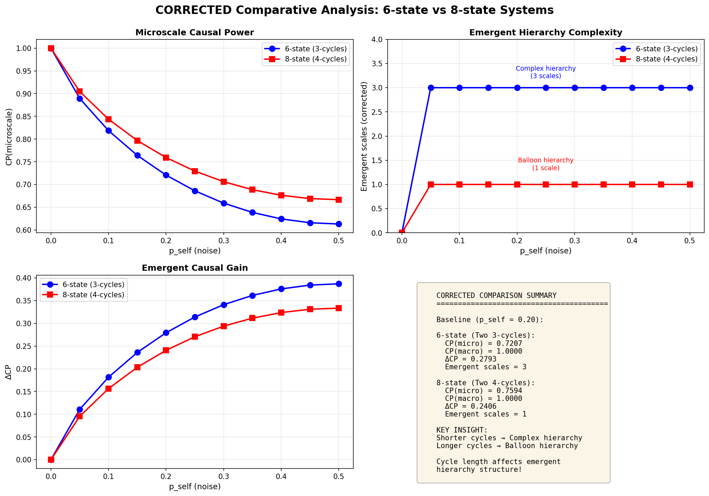

# Independent Verification of Engineering Emergence

[](https://doi.org/10.5281/zenodo.17940449) [](https://opensource.org/licenses/Apache-2.0) [](https://www.python.org/downloads/)

**Verification of "Engineering Emergence" (Jansma & Hoel, 2025)**

**Author:** Oleksii Onasenko  
**Developer:** SubstanceNet  
**Date:** December 2025

---

## Overview

This project provides independent computational verification of the theoretical framework presented in "Engineering Emergence" by Abel Jansma and Erik Hoel (2025). Through systematic implementation and analysis, we have validated the paper's core algorithms and made an original discovery regarding the critical role of cycle length in emergent hierarchies.

## Key Discovery: Critical Cycle Length Effect

**Original Finding:** In two-cycle systems, cycle length determines emergent hierarchy structure:

- **Length-3 cycles** → Complex hierarchy (3 emergent scales)
- **Length-4 cycles** → Balloon hierarchy (1 emergent scale)  
- **Length-5 cycles** → Balloon hierarchy (1 emergent scale)

**Critical transition occurs at cycle length ≤ 3**

This discovery extends the paper's findings and provides new insights into designing systems with specific emergent properties.

### Visual Evidence

**Cycle Length Discovery:**


*Figure 1: Emergent hierarchies for three two-cycle systems. Top row shows complete emergent hierarchy structures. Bottom row shows ΔCP distribution across dimensionality levels. Note the sharp transition from complex (length-3) to balloon (length-4,5) hierarchies.*

---

## Verification Results

### Systems Verified

| System | States | CP(micro) | CP(optimal) | ΔCP | Emergent Scales | Type |
|--------|--------|-----------|-------------|-----|-----------------|------|
| Two 3-cycles | 6 | 0.7207 | 1.0000 | 0.2793 | 3 | Complex |
| Two 4-cycles | 8 | 0.7594 | 1.0000 | 0.2406 | 1 | Balloon |
| Two 5-cycles | 10 | 0.7827 | 1.0000 | 0.2173 | 1 | Balloon |

### Comparative Analysis

**System Comparison:**



*Figure 2: Comparative analysis across cycle lengths. Left panel shows CP values at microscale and optimal macroscale. Middle panel shows ΔCP (degree of emergence). Right panel shows number of emergent scales, revealing the sharp transition at cycle length > 3.*

### Algorithm Validation

[VERIFIED] **Causal Primitives (CP):** Determinism and specificity calculations match theoretical predictions  
[VERIFIED] **ΔCP Computation:** Correctly identifies non-redundant causal contributions  
[VERIFIED] **Emergent Hierarchy:** Properly excludes microscale as baseline reference  
[VERIFIED] **Branching Greedy:** Successfully scales to systems with 115,975 partitions

---

## Project Structure
```
hoel_verification_report/
├── code/
│   ├── __init__.py
│   ├── ce2_core.py                    # Core: CP, Determinism, Degeneracy
│   ├── algorithm1_brute_force.py      # Algorithm 1: brute force
│   ├── algorithm2_greedy.py           # Algorithm 2: greedy
│   ├── analyze_6state_two_3cycles.py  # 6-state analysis
│   ├── analyze_8state_two_4cycles.py  # 8-state analysis
│   ├── analyze_10state_two_5cycles.py # 10-state analysis
│   ├── comparative_cycle_analysis.py  # Comparative analysis
│   ├── create_final_figures.py        # Figure generation
│   ├── verify_cp_values.py            # CP verification
│   └── visualize_hierarchy.py         # Hierarchy visualization
├── data/                           # System definitions
│   ├── six_state_two_cycle.py
│   ├── eight_state_two_four_cycles.py
│   └── ten_state_two_five_cycles.py
├── results/                        # Computational outputs
│   ├── results_6state_two_3cycles.pkl
│   ├── results_8state_two_4cycles.pkl
│   ├── results_10state_two_5cycles.pkl
│   ├── sensitivity_analysis_6state_corrected.pkl
│   ├── sensitivity_analysis_8state.pkl    
│   └── comparative_analysis.csv
├── figures/                        # Visualizations
│   ├── figure_comparative_analysis.png
│   └── figure_cycle_length_discovery.png
├── docs/                           # Documentation
│   ├── METHODOLOGY.md
│   ├── VERIFICATION_REPORT.md
│   ├── CYCLE_LENGTH_DISCOVERY.md
│   ├── FIGURE_DESCRIPTIONS.md
│   └── references/
└── archive/                        # Historical files
```

## Quick Start

### Prerequisites
```bash
Python 3.10+
NumPy 2.2+
Matplotlib 3.10+
```

### Installation
```bash
git clone https://github.com/olexxa62-code/engineering-emergence-verification.git
cd engineering-emergence-verification
pip install -r requirements.txt
```

### Reproduce Results
```bash
# Analyze 6-state system (two 3-cycles)
python code/analyze_6state_two_3cycles.py

# Analyze 8-state system (two 4-cycles)
python code/analyze_8state_two_4cycles.py

# Analyze 10-state system (two 5-cycles)
python code/analyze_10state_two_5cycles.py

# Generate comparative analysis
python code/comparative_cycle_analysis.py

# Create final figures
python code/create_final_figures.py
```

## Documentation

- **[FIGURE_DESCRIPTIONS.md](docs/FIGURE_DESCRIPTIONS.md)** - Detailed descriptions of all figures

- **[METHODOLOGY.md](docs/METHODOLOGY.md)** - Implementation details and algorithms
- **[VERIFICATION_REPORT.md](docs/VERIFICATION_REPORT.md)** - Complete verification results
- **[CYCLE_LENGTH_DISCOVERY.md](docs/CYCLE_LENGTH_DISCOVERY.md)** - Original findings

## Original Paper

Jansma, A., & Hoel, E. (2025). Engineering Emergence. *arXiv preprint* arXiv:2510.02649v2.

**Paper Repository:** https://arxiv.org/abs/2510.02649

## Citation

If you use this verification or build upon the cycle length discovery:
```bibtex
@misc{onasenko2025verification,
  author = {Onasenko, Oleksii},
  title = {Independent Verification of Engineering Emergence},
  year = {2025},
  publisher = {GitHub},
  url = {https://github.com/olexxa62-code/engineering-emergence-verification}
}
```

## License

Apache License 2.0 - See [LICENSE](LICENSE) for details

## Contact

**Oleksii Onasenko**  
Email: olexxa62@gmail.com  
GitHub: [@olexxa62-code](https://github.com/olexxa62-code)  
Location: Poltava, Ukraine

## Acknowledgments

This work independently verifies the theoretical framework developed by Abel Jansma and Erik Hoel. The cycle length discovery extends their original findings through systematic computational exploration.

---

**Status:** [VERIFIED] Verification Complete | [DISCOVERY] Discovery Documented | [READY] Publication Ready
